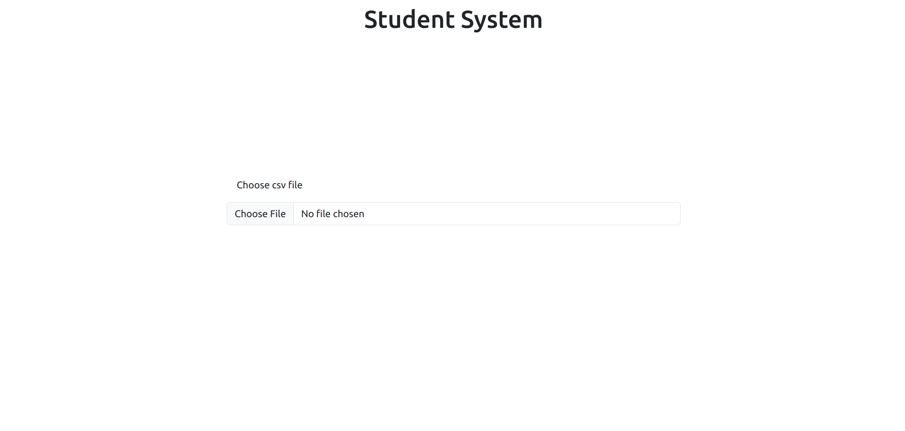
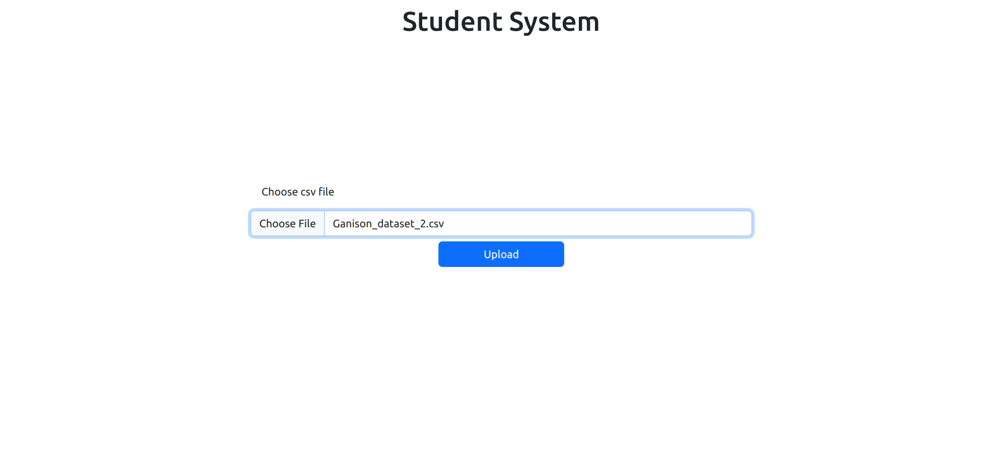
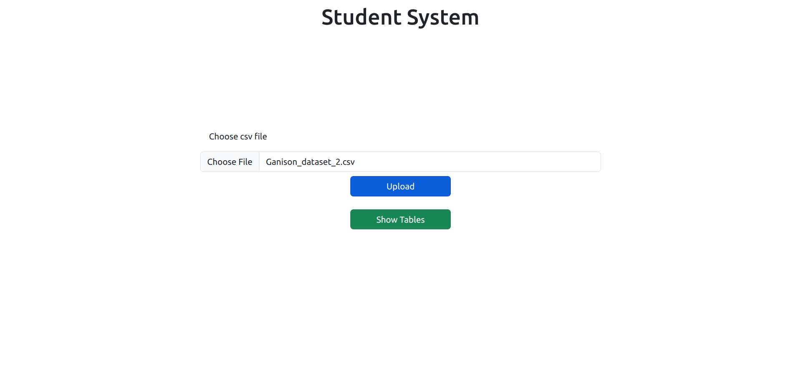
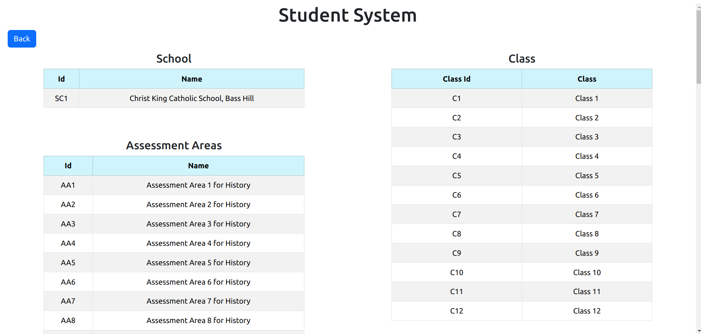
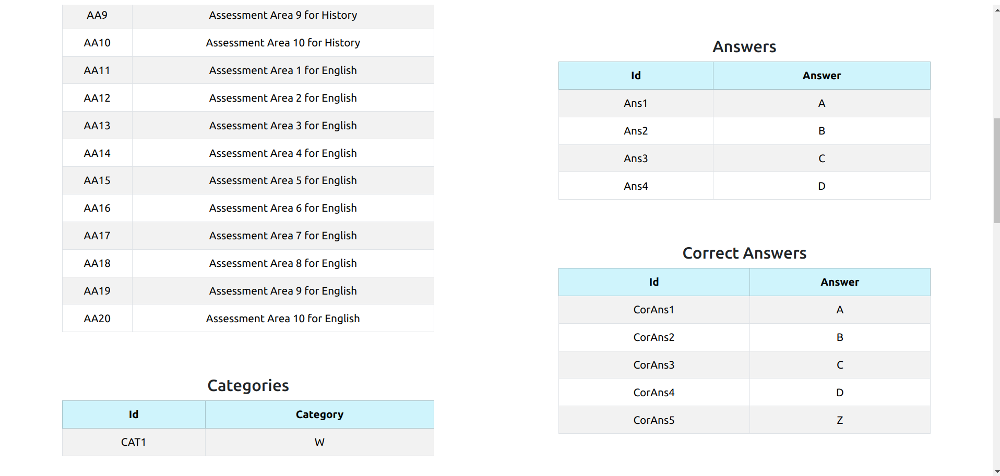
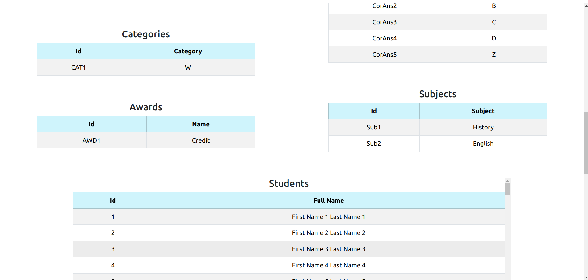
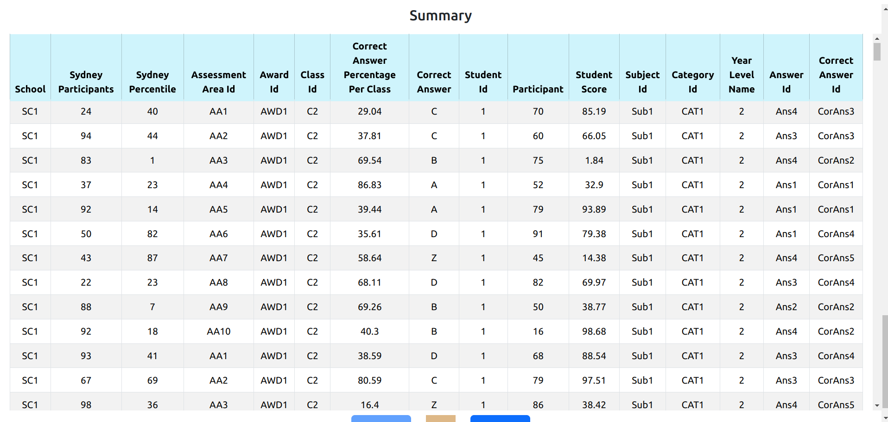
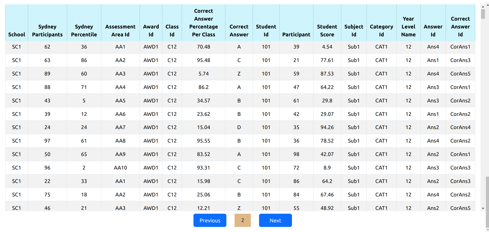

# Studend System

This is a web application for manipulating and displaying CSV file data in the tables.

## Technologies and Tools Used

- Python (Django, Pandas)
- Angular (Bootstrap)

## Getting Started

To get started with the Student System Application, follow these steps:

1. Clone the repository: `git clone https://github.com/KasunChathuranga3732/student-system.git`

#### For Linux
 - Open Terminal within the School folder
 - Run following commands
	- source Env/bin/activate
 	- python manage.py runserver
 - Open Terminal within the student-system folder
 - Run following commands
 	- pnpm i
 	- ng serve
 
 #### For Windows
 - Open CMD within the School folder
 - Run following commands
	- source Env\bin\activate
 	- python manage.py runserver
 - Open CMD within the student-system folder
 - Run following commands
 	- pnpm i
 	- ng serve

## License

Copyright &copy; 2023. All Rights Reserved.

## Screen Shots

